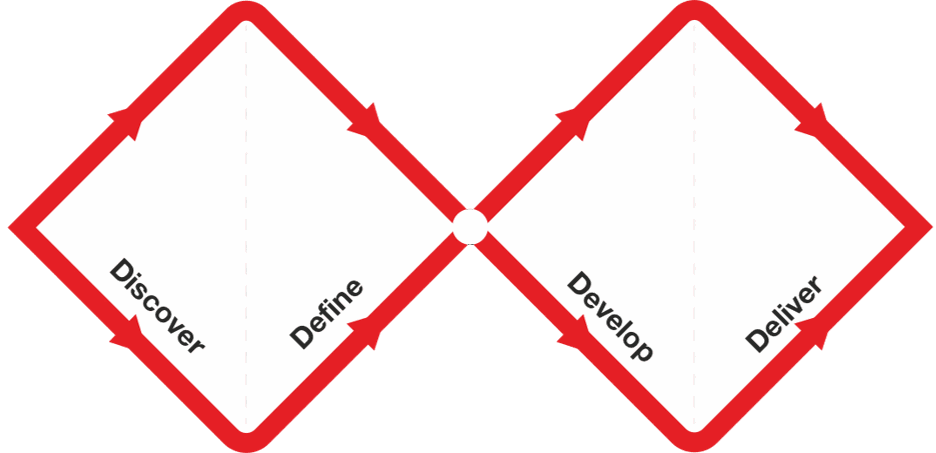
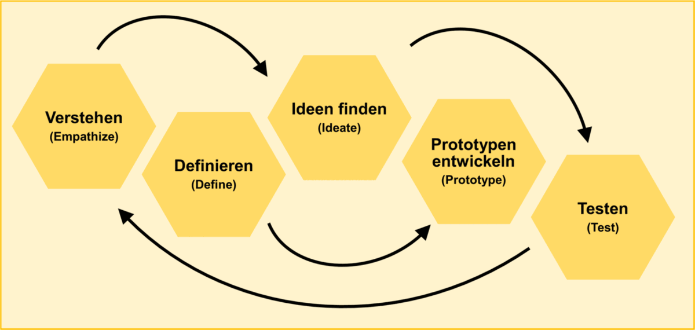
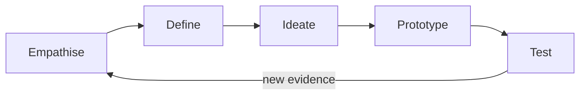

# Design Processes and Design Thinking

## Why Have a Design Process?

A design process is a structured set of activities that guides the creation or
improvement of a product, service, or experience. It gives a team a shared way
to move from a challenge to a decision while keeping room for learning.

Good processes help teams:

- understand users before committing to a solution;
- make assumptions visible;
- align product, design, engineering, and business perspectives;
- reduce the risk of investing in features nobody needs; and
- create deliberate moments for feedback and iteration.

A process is not a promise that the work will be linear. It is a map for making
the next useful decision.

## Design Thinking in Context

The course source deck presents several design processes. They overlap, but
they answer slightly different questions:

| Approach | Main emphasis | Useful when |
|---|---|---|
| Design Thinking | Human needs, creative problem solving, and iterative learning | The team needs to understand a problem and explore possible responses. |
| Double Diamond | Diverging and converging across problem and solution spaces | The team needs a simple shared picture of discovery, definition, development, and delivery. |
| Design Sprint | A short, facilitated sequence that moves from a challenge to a tested prototype | The team needs to answer a focused question quickly. |

These approaches are not mutually exclusive. A team may use the Double Diamond
to explain the overall shape of a project, Design Thinking modes to choose
activities, and a sprint format to timebox one experiment.

*The Double Diamond makes the alternation between exploration and focus visible.*

Source: [Design Council: The Double Diamond](https://www.designcouncil.org.uk/resources/the-double-diamond/), licensed under [CC BY 4.0](https://creativecommons.org/licenses/by/4.0/).

*This example shows the five stages as an iterative cycle. The German labels
are paired with English translations.*

Source: [Design Thinking-Prozess on Wikimedia Commons](https://commons.wikimedia.org/wiki/File:Design_Thinking-Prozess.png), by PowerlockeDurim, licensed under [CC BY-SA 4.0](https://creativecommons.org/licenses/by-sa/4.0/).

## The Five Design Thinking Modes

The course deck uses the familiar five-mode sequence:

The arrows show a useful default order, not a mandatory staircase. Testing can
change the definition of the problem. A prototype can reveal a missing user
need. New evidence can send the team back to empathy work.

## A Product Manager's Role

The Product Manager does not need to perform every design activity personally.
The role is to make the work useful and decision-ready:

1. Frame the outcome and constraints.
2. Protect time for user evidence before solution debates.
3. Make the team's assumptions and confidence visible.
4. Invite different perspectives without losing focus.
5. Decide what must be learned next.
6. Connect the result to product priorities and delivery choices.

AI can support this role by offering alternative framings or critique. It cannot
turn an unsupported assumption into evidence.

## Check Your Understanding

1. Why might a team use both the Double Diamond and Design Thinking?
2. What is the difference between a design process and a fixed recipe?
3. What kind of evidence could make a team return from Test to Empathise?

Show solution

1. The Double Diamond describes the overall shape of problem and solution work,
   while Design Thinking gives the team practical modes and activities.
2. A process gives structure and decision points, but the team can revisit earlier
   work when new evidence changes its understanding.
3. A failed task, an unexpected workaround, a contradictory interview, or a new
   observation could reveal that the team misunderstood the user's context.

