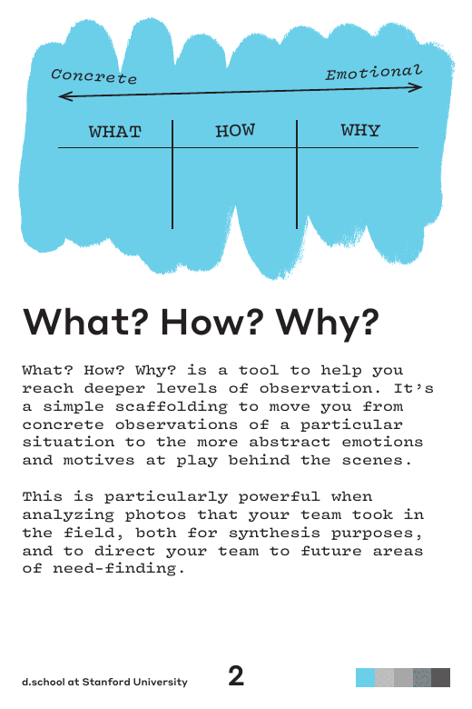
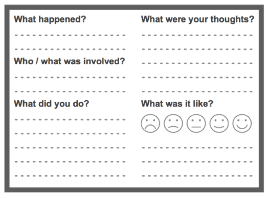
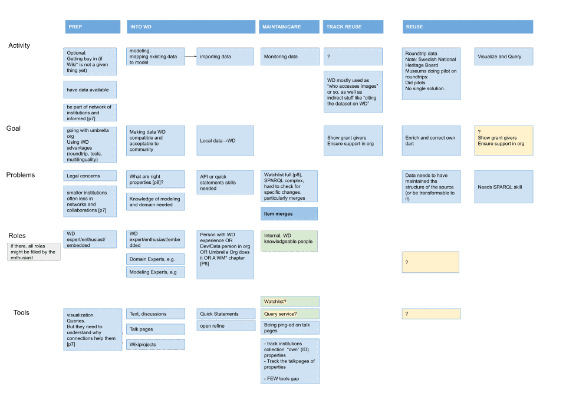
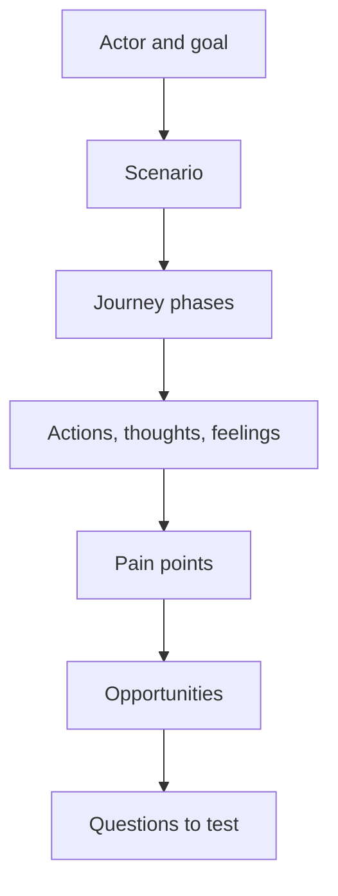

# Empathise with Evidence

## Start with the Person and the Goal

Empathise means making a serious effort to understand the person for whom the
team is designing. The focus is not only what someone does. It also includes:

- the goal they are trying to reach;
- the situation and constraints around the task;
- the workarounds they already use;
- what they think and feel at important moments; and
- what they need from the product or service.

The question is not "What feature should we build?" It is "What is happening in
this person's context, and what evidence do we have?"

## Evidence Before Interpretation

Use an evidence log to keep different levels of certainty separate:

| Type | Example | How to handle it |
|---|---|---|
| Direct evidence | A participant says they abandon a booking when availability appears too late. | Record the wording and context. |
| Behavioural evidence | Support tickets show repeated questions about changing an address. | Look for frequency and patterns. |
| Interpretation | Important information may appear after the user needs it. | Mark it as a synthesis, not a quote. |
| Assumption | Users would prefer a chatbot to the existing navigation. | Test it before treating it as a requirement. |

Useful inputs can include interviews, observations, usability sessions, support
tickets, analytics, existing research, reviews, and domain experts. A short
workshop may use desk research and peer interviews, but the output must state
which evidence is real, simulated, or still missing.

*Use What, How, and Why to move from concrete observation to cautious
interpretation. Treat the final column as a hypothesis to test.*

Source: [Stanford d.school Design Thinking Bootleg](https://dschool.stanford.edu/tools/design-thinking-bootleg), selected page, licensed under [CC BY-NC-SA 4.0](https://creativecommons.org/licenses/by-nc-sa/4.0/).

## Personas as Working Models

A persona is a compact model of a meaningful user group. It should help the team
make decisions, not become a fictional biography.

Include:

- a clearly described user group and context;
- a goal and the situation that creates it;
- relevant behaviours and constraints;
- evidence-backed needs or pain points; and
- open questions where evidence is weak.

Avoid unsupported demographic details, stereotypes, invented quotes, and false
precision. When AI helps draft a persona, label all generated material until a
human checks it against evidence.

## Journey Maps

A user journey map is a visual story of how someone interacts with a product or
service while trying to reach a goal. A useful map normally names:

1. the actor;
2. the scenario;
3. the goal;
4. the journey phases;
5. actions, thoughts, and feelings;
6. pain points and moments of uncertainty; and
7. opportunities for improvement.

Choose the scope deliberately. A long-shot map can cover a complete service
experience. A close-up map can focus on one uncertain interaction. The right
scope depends on the question the team is trying to answer.

*A small experience map can capture what happened, what the person did, thought,
and felt before the team designs a solution.*

Source: [GOV.UK Service Manual: Researching user experiences](https://www.gov.uk/service-manual/user-research/researching-user-experiences).

*A fuller journey map can combine activities, goals, problems, roles, and tools
across phases.*

Source: [Journey Map WD Cultural Institutions base version](https://commons.wikimedia.org/wiki/File:Journey_Map_WD_Cultural_Institutions_base_version.svg), by Jan Dittrich (WMDE), licensed under [CC BY 4.0](https://creativecommons.org/licenses/by/4.0/).

## Journey Map, User Flow, or Story Map?

These artefacts are related but not interchangeable:

| Artefact | Main question | Typical use |
|---|---|---|
| Journey map | What does the user experience across a broader journey? | Discovery, empathy, and opportunity finding. |
| User flow | What path does a user take through a specific interaction? | Designing screens, states, and decision points. |
| User story map | What user activities and stories should the product support, and in what release order? | Planning scope and delivery. |

## Practice: Map a Journey From Your Chosen Challenge

Choose a person, goal, and situation that your group can investigate. Map four
to six meaningful phases. For each phase, capture one action, one thought, one
emotion, and one piece of evidence or an explicit assumption.

Then mark one pain point and one opportunity. Do not design the feature yet.

## Check Your Understanding

1. Why should a persona contain open questions?
2. What makes a journey map different from a list of product features?
3. When would a close-up journey map be more useful than a long-shot map?

Show solution

1. Open questions show where the team lacks evidence and help define the next
   research activity.
2. A journey map describes a person's experience while pursuing a goal; it does
   not assume that a product feature is already the answer.
3. A close-up map is useful when one interaction contains the important
   uncertainty and needs more detail than the wider journey.

## References

- [Nielsen Norman Group: Journey Mapping 101](https://www.nngroup.com/articles/journey-mapping-101/)
- [GOV.UK Service Manual: User research](https://www.gov.uk/service-manual/user-research)
