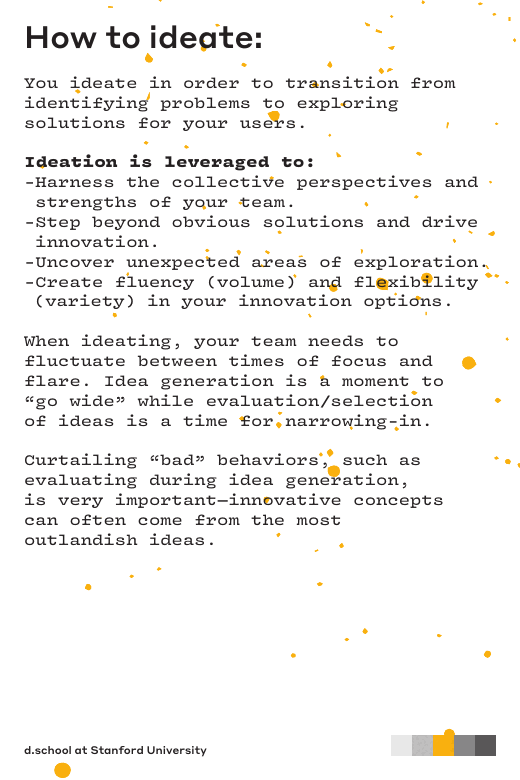

# Define and Ideate

## From Notes to a Useful Problem Frame

The Define mode turns a large amount of research into a focused challenge. It
is a synthesis activity, not a vote on the most popular feature idea.

A practical sequence is:

1. Cluster observations that seem related.
2. Name the user need or tension behind each cluster.
3. Separate evidence from interpretation.
4. Identify the user group and context that matter most.
5. Write a problem statement that can guide a design decision.

## A Strong Problem Statement

A problem statement should be:

- user-centred rather than solution-centred;
- specific enough to investigate;
- grounded in observed needs or behaviours;
- open to more than one response; and
- bounded by relevant constraints.

Compare these two frames:

| Weak frame | Stronger frame |
|---|---|
| We need better onboarding. | First-time volunteers struggle to choose a suitable task because role expectations appear after registration. |
| Add live tracking. | Customers waiting for a service need confidence that they will notice and understand an important change. |

The stronger frames describe a user situation and leave room for different
solutions.

## Point of View and How Might We

A Point of View (POV) makes the synthesis explicit:

> [User] needs [need] because [insight from evidence].

A How Might We (HMW) question opens the space without making the answer too
large:

> How might we help [user] [desired progress] when [relevant context]?

Example:

> How might we help a first-time volunteer choose a suitable task when they do
> not yet understand the role expectations?

Avoid HMW questions that already contain the solution, such as "How might we
build a notification feature?"

## Ideate Broadly, Then Converge Deliberately

Ideation creates many possible responses before the team selects a small set to
learn from. Useful techniques include:

- rapid brainstorming with deferred judgement;
- mind mapping around a user need;
- SCAMPER: Substitute, Combine, Adapt, Modify, Put to another use, Eliminate,
  Reverse;
- "What if..." prompts that change a constraint; and
- borrowing patterns from another domain.

The goal is not to keep every idea. It is to avoid committing to the first
plausible answer.

*During ideation, separate idea generation from evaluation so the team can
explore a wider solution space before narrowing it.*

Source: [Stanford d.school Design Thinking Bootleg](https://dschool.stanford.edu/tools/design-thinking-bootleg), selected page, licensed under [CC BY-NC-SA 4.0](https://creativecommons.org/licenses/by-nc-sa/4.0/).

## Select What to Learn From

Score ideas against the current decision, not personal preference:

| Criterion | Question |
|---|---|
| User value | Would this meaningfully address the observed need? |
| Learning value | Could a prototype test an important assumption? |
| Feasibility | Can the team make a convincing first version quickly? |
| Risk | What could mislead, exclude, or harm users? |

An idea with moderate certainty but high learning value may be a better first
prototype than an idea that looks polished but tests nothing important.

## Connect the Journey to the Backlog

Once the team understands a journey phase, it can express a need as a user
story:

> As a first-time volunteer, I want to compare the expectations of available
> tasks, so that I can choose one I am prepared to complete.

The story is a planning artefact, not proof that the proposed interface is the
right solution. The evidence and the learning question should remain attached.

## Check Your Understanding

1. Why is "build a mobile app" a weak problem statement?
2. What makes a HMW question useful for ideation?
3. Why might learning value be a better selection criterion than visual polish?

Show solution

1. It prescribes a solution and does not explain who has a problem, in what
   context, or what progress they need.
2. It describes a user and situation while leaving several possible responses
   open.
3. A prototype exists to reduce uncertainty. A less polished idea that tests a
   critical assumption can create more decision value.

