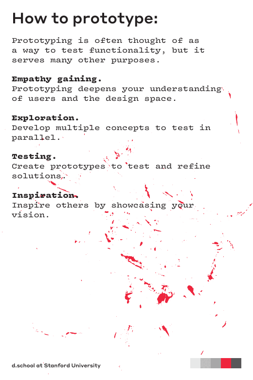
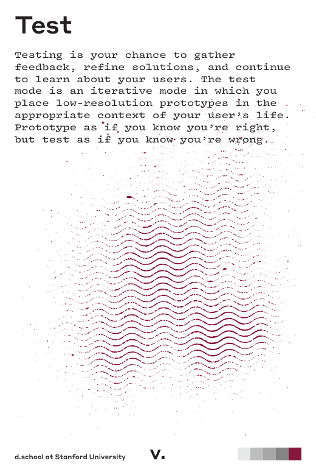
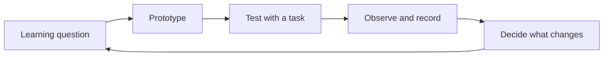

# Prototype, Test, and Iterate

## A Prototype Is a Learning Instrument

A prototype is a representation of an idea that lets a team learn before making
a larger commitment. It can be a sketch, paper flow, storyboard, clickable
wireframe, role-play, service script, or working technical slice.

Choose fidelity based on the question:

| Learning question | Suitable prototype |
|---|---|
| Does the overall journey make sense? | Storyboard or paper flow. |
| Can users find the next action? | Low-fidelity wireframe. |
| Does the interaction sequence work? | Clickable prototype. |
| Can a technical assumption work at all? | Small technical spike. |

Do not add detail merely because it looks professional. Detail can make people
react to visual polish instead of the assumption you need to test.

*Early prototypes can build empathy, explore alternatives, and test ideas before
they become expensive to change.*

Source: [Stanford d.school Design Thinking Bootleg](https://dschool.stanford.edu/tools/design-thinking-bootleg), selected page, licensed under [CC BY-NC-SA 4.0](https://creativecommons.org/licenses/by-nc-sa/4.0/).

## Plan a Lightweight Test

A useful test plan states:

- the learning question;
- the participant or proxy and the reason they are relevant;
- a realistic task, without explaining the intended solution;
- what the team will observe;
- the follow-up questions; and
- what evidence would change the design.

Prefer observing behaviour over asking whether someone likes the idea. A person
may say that a prototype looks good and still fail to complete the task.

*Testing is an opportunity to learn about users and refine both the solution and
the problem frame.*

Source: [Stanford d.school Design Thinking Bootleg](https://dschool.stanford.edu/tools/design-thinking-bootleg), selected page, licensed under [CC BY-NC-SA 4.0](https://creativecommons.org/licenses/by-nc-sa/4.0/).

### Example Task

Adapt this neutral structure to the project:

> Imagine you are [person in a realistic context]. Show me how you would
> [complete the goal] using this prototype.

The facilitator should avoid naming the intended control or explaining the
solution. Instead ask, "What would you do next?"

## Evidence and Decisions

After each test, separate:

| Observation | Interpretation | Decision |
|---|---|---|
| Two people looked at the departure time but missed the platform change. | The information hierarchy may not match the moment of need. | Test a version that groups time, platform, and connection status. |
| One person asked whether the notification was reliable. | Trust may be as important as visibility. | Add a trust question to the next test. |

Do not turn a single reaction into a universal requirement. Note the sample,
context, and confidence level.

## Iterate with a Clear Loop

Iteration can change the prototype, the HMW question, the persona, the journey
map, or the decision to continue. A good team can explain what it learned and
what it will deliberately not change yet.

## Responsible AI Support

AI can help generate alternative test tasks, identify ambiguous wording, or
role-play a skeptical reviewer. It cannot simulate real user evidence reliably
enough to replace a person. If a team uses an AI-simulated participant, label it
as a simulation and keep it separate from real observations.

## Check Your Understanding

1. How should prototype fidelity be chosen?
2. Why is "What would you do next?" usually better than "Do you like this?"
3. What should happen when a test challenges the problem frame rather than only
   the interface?

Show solution

1. Choose the lowest fidelity that can answer the current learning question.
2. It reveals behaviour and confusion during a task instead of collecting a
   vague opinion about the concept.
3. The team should update the relevant evidence and revisit the problem frame,
   persona, journey map, or HMW question before adding more features.

## References

- [Stanford d.school: Design Thinking Bootleg](https://dschool.stanford.edu/tools/design-thinking-bootleg)
- [GOV.UK Service Manual: Using moderated usability testing](https://www.gov.uk/service-manual/user-research/using-moderated-usability-testing)
