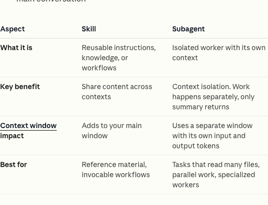
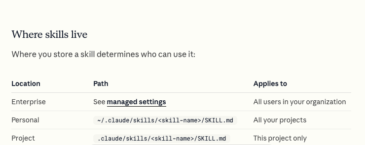
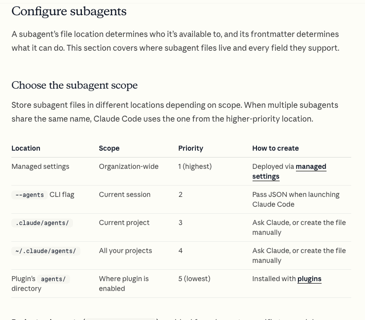

# Claude Code Skills and Subagents

## From Repeated Prompts to a Reusable Workflow

In the previous projects, Claude Code executed individual requests. In this
project, the AI Project Manager also shapes how Claude works.

A Skill stores reusable instructions, knowledge, or a multi-step workflow. A
subagent is a separate worker with its own context and a focused responsibility.
The main Claude Code conversation coordinates the work and returns to the human
for product decisions.

*Anthropic distinguishes reusable workflow content from isolated workers that
return a summary to the main conversation.*

Source: [Claude Code Docs: Extend Claude Code](https://code.claude.com/docs/en/features-overview#compare-similar-features).

| Mechanism | Use it for | Design Thinking example |
|---|---|---|
| Skill | A method or checklist that should be reused | Separate evidence, interpretation, and assumptions before creating discovery artifacts. |
| Subagent | A focused review that benefits from isolation | Audit whether each persona claim can be traced to research notes. |
| Main conversation | Work that needs shared context and human decisions | Select a challenge, approve a concept, and decide which prototype changes to accept. |

## A Project Skill

Claude Code discovers project Skills from
`.claude/skills/<skill-name>/SKILL.md`. A Skill includes a short description that
helps Claude decide when to use it and Markdown instructions that load when the
Skill runs.

*A project Skill is stored with the repository, so the group can inspect and
improve the same workflow.*

Source: [Claude Code Docs: Where Skills live](https://code.claude.com/docs/en/skills#where-skills-live).

For this workshop, ask Claude Code to derive a Design Thinking Skill from the
course modules. Review the resulting file rather than writing it line by line.
It should describe the method and guardrails, but it should not contain the
group's product answer.

Check that the Skill:

- uses only evidence supplied by the group;
- labels interpretation and assumptions;
- keeps divergent ideation separate from selection;
- asks for approval before committing to a concept or editing a prototype;
- treats AI-generated personas or reactions as simulations, not research; and
- records accepted, edited, and rejected suggestions.

Read the complete format and invocation options in
[Anthropic's Skills documentation](https://code.claude.com/docs/en/skills).

## Focused Project Subagents

Project subagents live in `.claude/agents/`. Each Markdown file defines a name,
description, allowed tools, and focused instructions. A subagent starts with an
isolated context and returns a summary to the main conversation.

*Project subagents can be shared in the repository and limited to the tools
needed for their review role.*

Source: [Claude Code Docs: Choose the subagent scope](https://code.claude.com/docs/en/sub-agents#choose-the-subagent-scope).

Use two project subagents in the workshop:

- an **evidence auditor** that reads research and discovery artifacts, then
  reports unsupported claims, mixed certainty levels, and missing evidence;
- a **prototype reviewer** that reads the approved learning question and
  prototype, then reports unclear flows, accessibility concerns, and test risks.

Ask Claude Code to create these project subagents. Keep them read-only so their
job is to challenge the work, not silently rewrite it. Review their generated
instructions and tool access before invoking them.

See [Anthropic's custom subagent documentation](https://code.claude.com/docs/en/sub-agents)
for the current file format, scope rules, and invocation options.

## What Must Stay Human

Skills and subagents can make the workflow more consistent, but they do not
create evidence. The group must still:

1. choose a challenge worth investigating;
2. collect or identify real evidence;
3. decide which interpretation is credible;
4. approve the concept and prototype direction;
5. observe real people using the prototype; and
6. accept, edit, or reject the proposed iteration.

The strongest result is not the most elaborate configuration. It is a visible
chain from evidence to decision, with Claude doing the production work and the
AI Project Manager controlling the gates.

## Check Your Understanding

1. Why should the Design Thinking method live in a Skill rather than in every
   prompt?
2. Why should an evidence audit run in a subagent?
3. Can a prototype-review subagent replace a usability participant?

Show solution

1. A Skill makes the method reusable and keeps repeated instructions consistent
   without mixing them with one project's evidence or solution.
2. The audit is a focused task that can read several artifacts in an isolated
   context and return only the findings to the main conversation.
3. No. It can find likely issues and improve a test plan, but only observation
   of relevant people creates user evidence.

## References

- [Claude Code Docs: Extend Claude with Skills](https://code.claude.com/docs/en/skills)
- [Claude Code Docs: Create custom subagents](https://code.claude.com/docs/en/sub-agents)
- [Claude Code Docs: Extend Claude Code](https://code.claude.com/docs/en/features-overview)
